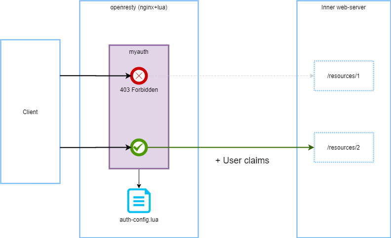

# myauth-lua

[](https://luarocks.org/modules/ozzy-ext/myauth) 

[](https://hub.docker.com/r/ozzyext/myauth-lua-host)

Ознакомьтесь с последними изменениями в [журнале изменений](/changelog.md).

## Обзор

LUA библиотека, позволяющая осуществлять контроль доступа к HTTP-ресурсам. 

Поддерживаемые способы аутентификации:

* анонимный доступа;
*  `Basic` ;
* `Bearer` на базе `JWT` токенов.

После успешной авторизации запрос к ресурсу снабжается заголовком авторизации с открытой схемой аутентификации [MyAuth](https://github.com/ozzy-ext-myauth/specification), указанной в конфигурации. А так же, другими заголовками, если они предусмотрены выбранной схемой аутентификации.

На схеме ниже отражена концепция работы сервиса с использованием `myauth` библиотеки.



## Настройки авторизации

### Файл настроек

Файл, содержащий настройки доступа к перечисленным `URL` в формате `LUA`. Содержание файла - присвоение переменным с фиксированными именами значений заданной структуры с данными об авторизации перечисленных `URL`.

Пример конфигурации:

```lua
debug_mode=true

dont_apply_for = {
	"/free_for_access"
}

only_apply_for = {
	"/"
}

black_list = {
	"/blocked"
}

anon = {
	"/pub"
}

basic = {
	{
		id = "user-1",
		pass = "user-1-pass",
		urls = {
			"/basic-access-[%d]+",
			"/basic-access-a"
		}
	},
	{
		id = "user-2",
		pass = "user-2-pass",
		urls = {
			"/basic-access-[%d]+"			
		}
	},
	{
		id = "user-2",
		pass = "user-2-pass",
		urls = {
			"/basic-access-2"			
		}
	}
}

rbac = {
	ignore_audience = false,
	rules = {
		{
			url = "/rbac-access-[%d]+",
			allow = { "role-1", "role-2" },
			deny = { "role-3", "role-4" },
			allow_get = { "role-5"  },
			deny_post = { "role-1"  }
		},
		{
			url = "/rbac-access-2",
 			allow_for_all = true
		}
	}
}
```

* `debug_mode` - `true`/`false`, устанавливает режим отладки. Подробнее о режиме отладки - ниже, в разделе [Отладка](##Отладка).
* `output_scheme` - исходящая схема аутентификации, используемая для передачи утверждений пользователя при доступе к ресурсу. Доступные значения:
  * [MyAuth1](https://github.com/ozzy-ext-myauth/specification/blob/master/v1/myauth-authentication-1.md) (по умолчанию)
* `dont_apply_for` - массив [шаблонов](https://www.lua.org/pil/20.2.html) `URL`, к которым не будет применяться авторизация;
* `only_apply_for` - массив [шаблонов](https://www.lua.org/pil/20.2.html) `URL`, к которым будет применяться авторизация. По умолчанию - ко всем; 
* `black_list` -  массив [шаблонов](https://www.lua.org/pil/20.2.html) `URL`, к которым будет запрещён доступ;
* `anon` - массив [шаблонов](https://www.lua.org/pil/20.2.html)`URL`, к которым будет предоставлен анонимный доступ;
* `basic` - массив пользователей, для которых доступна `basic`-авторизация и параметры их доступа:
  * `id` - идентификатор пользователя, используемый при формировании значения заголовка `Authentication`;
  * `pass` - пароль пользователя в открытом виде, используемый при формировании значения заголовка `Authentication`;
  * `urls` - массив [шаблонов](https://www.lua.org/pil/20.2.html) `URL` целевых ресурсов;
* `rbac` - настройки доступа на основе ролей при аутентификации с токеном доступа:
  * `ignore_audience` - флаг, отключающий проверку `audience` токена; `false` - по умолчанию;
  * `rules` - массив правил
    * `url` - [шаблон](https://www.lua.org/pil/20.2.html) `URL` целевого ресурса;
    * `allow_for_all` - `true`/`false`, устанавливает разрешение доступа для любой роли; По сути - доступ для любого авторизованного пользователя;
    * `allow` - массив ролей пользователей, которым разрешён доступ к целевому ресурсу без учёта `http`-метода;
    * `deny` - массив ролей пользователей, которым запрещён доступ к целевому ресурсу без учёта `http`-метода;
    * `allow_get` - массив ролей пользователей, которым разрешён доступ к целевому ресурсу с `http`-методом `GET`. Аналогично, для любого `http`-метода;
    * `deny_get` - массив ролей пользователей, которым запрещён доступ к целевому ресурсу с `http`-методом `GET`. Аналогично, для любого `http`-метода;

### Файл секретов

Файл с секретами содержит данные, которые не должны иметь ограниченный доступ. В текущей версии секреты состоят из:

* `jwt_secret` - ключ для проверки подписи `JWT` токена по алгоритму `HS256`.

Формат файла - `LUA` скрипт с объявлением переменных.

Пример:

```lua
jwt_secret = "some-secret"
```

### Шаблоны 

Шаблоны `URL` - не регулярные выражения, а имеют специальный LUA-формат для шаблонов. [Оф документация](https://www.lua.org/pil/20.2.html). 

Важной особенностью шаблонов конфигурации является возможность не экранировать дефис (`-`). Т.е. при написании шаблона для `/some-resource` пришлось бы писать `/some%-resource`, но именно в этом конфигурационном файле этого можно не делать. Это сделано для удобства, потому что дефис (`-`) часто встречается в `URL`.

### Порядок проверки доступа

Общий алгоритм:

* если найдено совпадение в `black_list` - **отказ**;
* если найдено совпадение в `dont_apply_for` - **разрешение**;
* если объявлен список `only_apply_for` и в нём нет совпадений - **отказ**;
* если нет заголовка `Authorization`, то используются правила `anon`:
  * если найдено совпадение в `anon` - **разрешение**;
  * иначе - **отказ**;
* если авторизация `Basic`, то используются правила `basic`:
  * если нет совпадений по пользователю - **отказ**;
  * если есть совпадение по имени пользователя, то используются настройки этого пользователя;
    * если найдено совпадение в списке `urls` - **разрешение**;
    * иначе - **отказ**;
* если авторизация `Bearer`, то используются правила `rbac`:
  * если нет совпадений в `roles` по полю `url` - **отказ**;
  * если есть совпадения, то происходит вычисление разрешения по всем совпадениям по следующим правилам:
    * в каждом совпадении проверяется `allow_for_all`. Если хотя бы в одном этот параметр установлен в `true`, то есть разрешающий фактор;
    * в каждом совпадении ищутся роли пользователя в `allow` и `allow_xxx` (в соответствии с `http`-методом). Если найдены, то есть разрешающий фактор;
    * в каждом совпадении ищутся роли пользователя в `deny` и `deny_xxx` (в соответствии с `http`-методом). Если найдены, то есть запрещающий фактор;
    * если есть хотя бы один запрещающий фактор, то - **отказ**;
    * если есть хотя бы один разрешающий фактор, то - **разрешение**;
    * в противном случае (нет ни разрешений, ни запрещений) - **отказ**;
* в противном случае (другой тип авторизационных данных в заголовке `Authorization`) - **отказ**.

## Развёртывание

Собственный сервис авторизации с использованием библиотеки `myauth` - это `nginx` с поддержкой `LUA` в котором используется `LUA`-библиотека `myauth` для авторизации доступа к локациям.

Дальнейшее изложение подразумевает развёртывание собственного сервиса авторизации на базе `docker`.

#### Что делать?

Чтобы развернуть сервис авторизации на базе `myauth-lua` необходимо:

* развернуть `docker`-контейнер, руководствуясь одним из подходов:
  * [Готовый docker-образ](#Готовый-docker-образ)
  * [Собственный docker-образ](#Собственный-docker-образ)
* разработать [фал(ы) настроек](#Файл-настроек)
* разработать [файл секретов](#Файл-секретов)
* разработать [конфигурационный файл nginx](#Конфиг-nginx), где:
  * [загрузить файл конфигурации](#load(filepath)) или [загрузить директорию с файлами конфигурации](#load_dir(dirpath))
  * [загрузить файл с секретами](#myauth.secrets)
  * [создать объект авторизации](#new(init_config,-init_secrets-[,-event_listener]-[,-nginx_strategy]))
  * в нужных локациях добавить [проверку авторизации](#authorize())
  * опционально, предоставлять [метрики](#Применение)
* подключить файл(ы) настроек в контейнер в отдельную директорию. Например, `/myauth/configs`
* подключить файл секретов в контейнер. Например, `/myauth/secrets.lua`
* подключить файл настроек `nginx` в контейнер. Например, `/etc/nginx/conf.d/default.conf`

#### Готовый docker-образ

Для большинства случаев подойдёт использование [готового docker-образа](https://hub.docker.com/r/ozzyext/myauth-lua-host) для. Этот образ:

* базируется на `openresty/openresty:1.15.8.3-centos`
* содержит установленные компоненты, необходимые для установки `luarocks` пакетов
* содержит установленный `myauth-lua` соответствующей версии

#### Собственный docker-образ

Рекомендации по разработке `docker`-образа собственного сервиса авторизации:

* использовать образ [openresty](https://hub.docker.com/r/openresty/openresty/) в качестве базового образа

  ```dockerfile
  FROM openresty/openresty
  ```

  или для фиксации номера версии (пример для `centos`)

  ```dockerfile
  FROM openresty/openresty:1.15.8.3-centos
  ```

* установить `git` и `gcc` для сборки библиотеки и зависимостей (пример для `centos`)

  ```dockerfile
  RUN yum -y install git gcc
  ```

* установить библиотеку `myauth`

  ```dockerfile
  RUN /usr/local/openresty/luajit/bin/luarocks install myauth
  ```

  или для фиксации номера версии

  ```dockerfile
  RUN /usr/local/openresty/luajit/bin/luarocks install myauth 1.2.2
  ```

Или разработать docker-образ на базе [готового docker-образа](https://hub.docker.com/r/ozzyext/myauth-lua-host), описанного в [предыдущем разделе](#готовый-docker-образ). 

#### Конфиг nginx

Рекомендации по разработке конфигурационного файла `nginx` с использованием `myauth`:

* на уровне http разместить блок инициализации

  ```nginx
  init_worker_by_lua_block {
  	
  	local config = require "myauth.config".load("/app/configs/auth-config.lua")
  	local secrets = require "myauth.secrets".load("/app/configs/auth-secrets.lua")
  
  	myauth = require "myauth".new(config, secrets)
  }
  
  server {
  	....
  }
  ```
  
* на уровне локаций, в которых необходимо проверять авторизацию, добавить код:

  ```nginx
  location / {
  
      access_by_lua_block {
      	myauth:authorize()
      }
      proxy_pass http://...;		
  }
  ```

## API

### myauth.config

#### load(filepath)

Загружает файл конфигурации `myauth` из файла `filepath`.

```lua
local cfg = require "myauth.config"
local mycfg = cfg.load('/path/to/cfg.lua')
```

#### load(filepath, base_config)

Загружает файл конфигурации `myauth` из файла `filepath` и объединяет его с ранее загруженным конфигом `base_config`.

```lua
local cfg = require "myauth.config"
local mycfg = cfg.load('/path/to/cfg.lua')
mycfg = cfg.load('/path/to/cfg-2.lua', mycfg)
```

Объединение происходит по следующему принципу:

* `debug_mode` - переопределяется последующим конфигом, если значение указано 
* `output_scheme` - переопределяется последующим конфигом, если значение указано
* `dont_apply_for` - объединение массивов
* `only_apply_for` - объединение массивов
* `anon` - объединение массивов
* `black_list` - объединение массивов
* `basic` - объединение массивов
* `rbac.ignore_audience` - переопределяется последующим конфигом, если значение указано 
* `rbac.rules` - объединение массивов

#### load_dir(dirpath)

Загружает и объединяет файлы конфигурации `myauth` из директории `direpath`

```lua
local cfg = require "myauth.config"
local mycfg = cfg.load('/path/to/cfg.lua')
mycfg = cfg.load('/path/to/cfg-2.lua', mycfg)
```

Объединение происходит как в случае `load(filepath, base_config)`

### myauth.secrets

#### load(filepath)

Загружает файл с секретами`myauth` из файла `filepath`.

```lua
local secrets = require "myauth.secrets".load('/path/to/secrets.lua')
```

### myauth

#### new(init_config, init_secrets [, event_listener] [, nginx_strategy])

Инициализирует модуль авторизации.

```lua
local config = require "myauth.config".load("/app/configs/auth-config.lua")
local secrets = require "myauth.secrets".load("/app/configs/auth-secrets.lua")

a = require "myauth".new(config, secrets)
```

 #### authorize()

Авторизирует текущий запрос `nginx`

```nginx
server {
	
    ...
    
	location / {
    
		access_by_lua_block {

			myauth:authorize()
		}
		proxy_pass ...;		
	}
}
```

### event_listener

Слушатель событий авторизации. Получает вызовы от модуля авторизации при возникновении событий авторизации.

```lua
local config = ...
local secrets = ...
local event_listener = require "myauth.empty-event-listener"

myauth = require "myauth".new(config, secrets, event_listener)
```

#### on_allow_dueto_dont_apply_for(url)

Вызывается при разрешении доступа по причине нахождения `url` в списке путей, не подлежащих проверке.

Параметры:

* `url`  - относительный путь запроса

#### on_allow_dueto_only_apply_for(url)

Вызывается при разрешении доступа по причине отсутствия `url` в списке путей, подлежащих проверке.

Параметры:

* `url`  - относительный путь запроса

#### on_deny_dueto_black_list(url)

Вызывается при отказе доступа по причине нахождения `url` в чёрном списке путей.

Параметры:

* `url`  - относительный путь запроса

#### on_deny_dueto_unsupported_auth_type(url, auth_header)

Вызывается при отказе доступа из-за неуказанного или неожиданного типа авторизации.

Параметры:

* `url`  - относительный путь запроса
* `auth_header` - содержание заголовка авторизации

#### on_deny_dueto_no_anon_rules_found(url)

Вызывается при запрете анонимного доступа по причине отсутствия `url` в списке путей с разрешённым анонимным доступом.

Параметры:

* `url`  - относительный путь запроса

#### on_deny_dueto_no_anon_config(url)

Вызывается при запрете анонимного доступа по причине отсутствия в конфигурации списка путей с разрешённым анонимным доступом.

Параметры:

* `url`  - относительный путь запроса

#### on_allow_anon(url)

Вызывается при разрешении анонимного доступа.

Параметры:

* `url`  - относительный путь запроса

#### on_deny_dueto_no_basic_config(url)

Вызывается при запрете доступа с `basic` авторизацией по причине отсутствия в конфигурации информации о `basic` авторизации.

Параметры:

* `url`  - относительный путь запроса

#### on_deny_dueto_wrong_basic_pass(url, user_id)

Вызывается при запрете доступа с `basic` авторизацией по причине неправильного пароля.

Параметры:

* `url`  - относительный путь запроса
* `user_id` - идентификатор клиента из заголовка авторизации

#### on_deny_dueto_no_basic_rules_found(url, user_id)

Вызывается при запрете доступа с `basic` авторизацией по причине отсутствия правила `basic` авторизации для указанного пути и пользователя.

Параметры:

* `url`  - относительный путь запроса
* `user_id` - идентификатор клиента из заголовка авторизации

#### on_allow_basic(url, user_id)

Вызывается при разрешении доступа с `basic` авторизацией.

Параметры:

* `url`  - относительный путь запроса
* `user_id` - идентификатор клиента из заголовка авторизации

#### on_deny_dueto_no_rbac_config(url)

Вызывается при запрете доступа с `bearer` авторизацией по причине отсутствия в конфигурации информации о `rbac` авторизации.

Параметры:

* `url`  - относительный путь запроса

#### on_deny_no_rbac_rules_found(url, http_method, sub)

Вызывается при запрете доступа с `bearer` авторизацией по причине отсутствия правила `rbac` авторизации для указанного пути, `http`-метода и субъекта.

Параметры:

* `url`  - относительный путь запроса
* `http_method` - `http`-метод
* `sub` - субъект из токена 

#### on_allow_rbac(url, http_method, sub)

Вызывается при разрешении доступа с `bearer` авторизацией по `rbac` правилу.

Параметры:

* `url`  - относительный путь запроса
* `http_method` - `http`-метод
* `sub` - субъект из токена 

#### on_deny_rbac_token(url, host, error_code, error_reason)

Вызывается при запрете доступа с `bearer` авторизацией по причине того, что токен не прошёл проверку.

Параметры:

* `url`  - относительный путь запроса
* `host`- host, указанный в запросе
* `error_code` - код ошибки:
  *  `missing_token` - токен не указан
  * `invalid_token_sign` - токен имеет некорректную подпись
  * `invalid_token_format` - токен имеет неверный формат
  * `invalid_token` - некорректный токен (остальные причины)
  * `invalid_audience`  - нецелевое использование
  * `no_host` - не указан хост запроса, необходимый для проверки цели использования

## Метрики

### Применение

`myauth-lua` в составе содержит модуль `myauth.prometheus-event-listener`. Этот модуль позволяет вести метрики событий авторизации. 

Ниже приведён пример создания объекта проверки авторизации `myauth` с передачей ему слушателя событий авторизации `event_listener` для ведения метрик событий авторизации.

```lua
local config = ...
local secrets = ...
local prometheus = require("prometheus").init(....) 
...

local event_listener = require "myauth.prometheus-event-listener".new(prometheus)

myauth = require "myauth".new(config, secrets, event_listener)
```

Объект `prometheus` - модуль [nginx-lua-prometheus](https://github.com/knyar/nginx-lua-prometheus) или совместимый по интерфейсу объект.

Так же необходимо предоставлять метрики для потребления. На примере ниже показано, как предоставлять метрики по запросу к `/metrics`:

```nginx
location /metrics {
    content_by_lua_block {
        prometheus:collect()
    }
}
```

### Метрики

Метрики авторизации:

* `myauth_allow_total{"server", url", "reason"}` - счётчик. Общее количество запросов с разрешённым доступом:
  * `server` - сервер из настроек `nginx`, в контексте которого обрабатывается запрос;
  * `url` - путь запроса;
  *  `reason` - литеральный идентификатор причины разрешения;
    * `dont_apply_for` - разрешение доступа по причине нахождения `url` в списке путей, не подлежащих проверке;
    * `only_apply_for` - разрешение доступа по причине отсутствия `url` в списке путей, подлежащих проверке;
    * `anon` - разрешение анонимного доступа;
    * `basic` - разрешение доступа с `basic` авторизацией;
    * `rbac` - разрешение доступа с `bearer` авторизацией по `rbac` правилу;
* `myauth_deny_total{"server", "url", "reason"}` - счётчик. Общее количество запросов с запрещённым доступом:
  * `server` - сервер из настроек `nginx`, в контексте которого обрабатывается запрос;
  * `url` - путь запроса;
  *  `reason` - литеральный идентификатор причины запрета:
    * `black_list` - запрет доступа по причине нахождения `url` в чёрном списке путей;
    * `unsupported_auth_type` - запрет доступа из-за неуказанного или неожиданного типа авторизации;
    * `no_anon_rules_found` - запрет анонимного доступа по причине отсутствия `url` в списке путей с разрешённым анонимным доступом;
    * `no_anon_config` - запрет анонимного доступа по причине отсутствия в конфигурации списка путей с разрешённым анонимным доступом;
    * `no_basic_config` - запрет доступа с `basic` авторизацией по причине отсутствия в конфигурации информации о `basic` авторизации;
    * `wrong_basic_pass` - запрет доступа с `basic` авторизацией по причине неправильного пароля;
    * `no_basic_rules_found` - запрет доступа с `basic` авторизацией по причине отсутствия правила `basic` авторизации для указанного пути и пользователя;
    * `no_rbac_config` - запрет доступа с `bearer` авторизацией по причине отсутствия в конфигурации информации о `rbac` авторизации;
    * `no_rbac_rules_found` - запрет доступа с `bearer` авторизацией по причине отсутствия правила `rbac` авторизации для указанного пути, `http`-метода и субъекта;
    * `rbac_token_missing_token` - запрет доступа с `bearer` авторизацией по причине того, что токен не указан;
    * `rbac_token_invalid_token_sign` - запрет доступа с `bearer` авторизацией по причине того, что токен имеет некорректную подпись;
    * `rbac_token_invalid_token_format` - запрет доступа с `bearer` авторизацией по причине того, что токен имеет неверный формат;
    * `rbac_token_invalid_token` - запрет доступа с `bearer` авторизацией по причине того, что токен не прошёл проверку (другие причины);
    * `rbac_token_invalid_audience` - запрет доступа с `bearer` авторизацией по причине нецелевого использования токена;
    * `rbac_token_no_host` - запрет доступа с `bearer` авторизацией по причине того, что не указан хост запроса, необходимый для проверки цели использования.

### Пример

```
# HELP myauth_allow_total Number of allowed requests
# TYPE myauth_allow_total counter
myauth_allow_total{server="default_server",url="/free_for_access",reason="dont_apply_for"} 6
myauth_allow_total{server="default_server",url="/rbac-access-1",reason="rbac"} 6
myauth_allow_total{server="default_server",url="/rbac-access-allow",reason="rbac"} 3
# HELP myauth_deny_total Number of denied requests
# TYPE myauth_deny_total counter
myauth_deny_total{server="default_server",url="/blocked",reason="black_list"} 3
myauth_deny_total{server="default_server",url="/rbac-access-1",reason="no_rbac_rules_found"} 6
myauth_deny_total{server="default_server",url="/rbac-access-allow",reason="rbac_token_invalid_token_format"} 3
myauth_deny_total{server="default_server",url="/rbac-access-allow",reason="rbac_token_invalid_token_sign"} 3
myauth_deny_total{server="default_server",url="/rbac-access-allow",reason="unsupported_auth_type"} 3
```

## Особенности реализации схем аутентификации

### MyAuth v1

#### Basic

При `Basic` аутентификации, в результирующий заголовок авторизации попадает только идентификатор пользователя под именем `sub`(subject, по аналогии с тем, как этот параметр называется в `jwt`). Пример заголовка авторизации для пользователя `foo-user`:

```
Authorization: MyAuth1 sub="foo-user"
```

#### Bearer

При `Bearer` аутентификации с `jwt` токеном, все утверждения из токена попадают в заголовок авторизации со своими именами.

### MyAuth v2

#### Basic

При `Basic` аутентификации, кроме заголовка авторизации, добавляется только заголовок с идентификатором пользователя `X-Claim-User-Id`. Пример заголовка авторизации для пользователя `foo-user`:

```
Authorization: MyAuth2
X-Claim-User-Id: foo-user
```

#### Bearer

##### Имена заголовков

При `Bearer` аутентификации с `jwt` токеном, кроме заголовка авторизации, все утверждения из токена добавляются в перенаправленный запрос в виде заголовков с префиксом `X-Claim-<нормализованный_тип_утверждения>`. 

Нормализация типа утверждения:

* заменяет разделитель `:` на `-`;
* первые буквы разделённых слов переводи в верхний регистр.

Пример утверждений:

```
MyClaim1 = val1
myClaim2 = val2
my-claim-3 = val3 
my:claim:4 = val4
```

Заголовки перенаправленного запроса по этим утверждениям:

```
Authorization: MyAuth2
X-Claim-MyClaim1: val1
X-Claim-MyClaim2: val2
X-Claim-My-Claim-3: val3
X-Claim-My-Claim-4: val4
```

##### Зарезервированные заголовки

Для следующих утверждений используются фиксированные имена заголовков:

* `sub` -> `X-Claim-User-Id`;
* `roles` -> `X-Claim-Roles`;
* `role` -> `X-Claim-Role`;
* `http://schemas.microsoft.com/ws/2008/06/identity/claims/role` -> `X-Claim-Role`;

##### Утверждения-массивы

Утверждения-массивы из `jwt` токена сериализуются в строку, где значения массива разделены запятыми. 

Пример: 

```
Authorization: MyAuth2
X-Claim-Roles: admin,user
```

## Отладка 

Режим отладки позволяет получить более подробную информацию о процессе авторизации внутри прокси из текущего запроса. В режиме отладки:

* содержательная часть отрицательных ответов содержат раскрытую причину отказа;
* ответ содержит отладочные заголовки с дополнительной информацией.

Для включения режима отладки укажите в конфигурации 

```lua
debug_mode=true
```

### Отладочные заголовки

Отладочные заголовки передаются в ответе от прокси авторизации и предназначены для отладки процесса авторизации в прокси.

#### Пример с успешной авторизацией

```
"x-debug-authorization-header": "MyAuth2",
"x-debug-rbac": "{\"roles\":[\"User3\"],\"url\":\"\\\/rbac-access-1\",\"method\":\"GET\",\"rules\":[{\"total_factor\":true,\"allow_get\":\"User3\",\"pattern\":\"\\\/rbac-access-[%d]+\"}]}",
"x-debug-claim-user-id": "0cec067f8dac4d189551202406e4147c",
"x-debug-claim-myauth-clime": "ClimeVal",
"x-debug-claim-roles": "User3",
```

`x-debug-rbac`:

```json
{
  "roles": [
    "User3"
  ],
  "url": "\\/rbac-access-1",
  "method": "GET",
  "rules": [
    {
      "total_factor": true,
      "allow_get": "User3",
      "pattern": "\\/rbac-access-[%d]+"
    }
  ]
}
```

#### Пример, когда отказано в доступе

```
"x-debug-rbac": "{\"roles\":[\"User2\"],\"url\":\"\\\/rbac-access-1\",\"method\":\"GET\",\"rules\":[{\"total_factor\":false,\"pattern\":\"\\\/rbac-access-[%d]+\",\"deny\":\"User2\"}]}",
"x-debug-msg": "No allowing rules were found for bearer",
```

`x-debug-rbac`:

```json
{
  "roles": [
    "User2"
  ],
  "url": "\\/rbac-access-1",
  "method": "GET",
  "rules": [
    {
      "total_factor": false,
      "pattern": "\\/rbac-access-[%d]+",
      "deny": "User2"
    }
  ]
}
```

#### X-Debug-Authorization-Header

Содержит значения заголовка `Authorization` запроса, перенаправленного к запрашиваемому ресурсу.

#### X-Debug-Rbac

Передаёт `json`-объект, содержащий данные о проверке авторизации на базе ролей.

Пример содержания заголовка:

```json
{
  "roles": [
    "User1"
  ],
  "url": "\\/rbac-access-1",
  "method": "POST",
  "rules": [
    {
      "total_factor": false,
      "allow": "User1",
      "deny_post": "User1",
      "pattern": "\\/rbac-access-[%d]+"
    }
  ]
}
```

#### X-Debug-Claim-...

Добавляются только при исходящей аутентификации `MyAuth2`. Они содержат значения соответствующих заголовков `X-Claim-...` в перенаправленном запросе.

#### X-Debug-Msg

Передаёт сообщение от логики авторизации, поясняющее статус ответа.